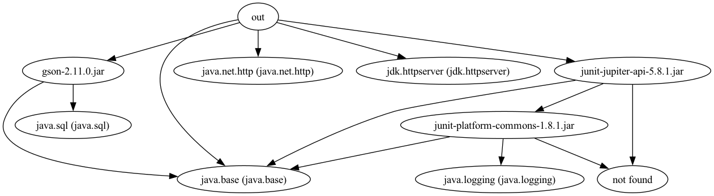

# Create Minimal Runtimes with `jlink`

## Project Structure

Here's a breakdown of the different project components:

* `src/main/java`: The source code for the project, organized by package:
    * `eu.ammbra.bday.Organizer.java`: The main entry point of the application, possibly responsible for coordinating the overall flow of the program.
    * `eu.ammbra.bday.details`: A package containing domain model classes. These classes represent entities involved in birthday celebrations, such as cakes, parties, and people attending them.
    * `eu.ammbra.bday.handlers`: A package containing classes responsible for handling specific tasks. 
    * `eu.ammbra.bday.operations`: A package containing classes responsible for handling the operational side of parties.
    * `eu.ammbra.bday.store`: A package containing classes responsible for interacting with data from files.
* `src/main/resources/store/events.json`: A resource file containing sample event data in JSON format.
* `static`: A folder holding client-side related static files.
* `src/test/java`: The source code for unit tests and integration tests.
* `src/snippets`: The JSON snippets folder.


## **Lab Activity No 1**: Analyze the Project's Dependencies with `jdeps`

The `jdeps` tool analyzes your Java application’s dependencies and provides package or class level details, by identifying:

* dependencies your project actively uses, 
* transitive dependencies that your project indirectly relies on, 
* missing dependencies that can cause errors.

To leverage `jdeps` you need either compiled Java classes (`.class` files) or a JAR file. **Your task** relies on you to do the following steps:

1. Open another terminal window and place yourself in `D_bday_jlink` folder.
2. Let's find all the Java files in the project, store their path in a file and compile them via command-Line argument files (`@sourcefiles.txt`).

```shell
# Windows specific commands to get Java files from current directory
dir /s /B *.java > sourcefiles.txt

javac --enable-preview  --source 23 -cp "..\lib\*" @sourcefiles.txt -d out

# unix/macOS specific commands to get Java files from current directory

find . -name "*.java" > sourcefiles.txt

javac --enable-preview --source 23 -cp "../lib/*" @sourcefiles.txt -d out
```
3. Get a summary of your dependencies by running:

```shell
# unix/macOS specific command
jdeps --multi-release 23 --class-path '../lib/*' -s out/

# Windows specific commands
jdeps --multi-release 23 --class-path '..\lib\*' -s out\
```
4. Observe the output of previous command and check if there are dependencies not found. In such scenarios, is best to scan recursively your files:

```shell
# unix/macOS specific command
jdeps --multi-release 23 --class-path '../lib/*' -recursive out/

# Windows specific commands
jdeps --multi-release 23 --class-path '..\lib\*' -recursive out\
```
5. To better observe the output, you can export the dependencies details as a DOT format.

```shell
# unix/macOS specific command
jdeps --class-path '../lib/*' --dot-output graph --ignore-missing-deps --multi-release 23 -recursive out/

# Windows specific commands
jdeps --class-path '..\lib\*' --dot-output graph --ignore-missing-deps --multi-release 23 -recursive out\
```
With tools like https://graphviz.org/ you can visualize the dependencies in a `.PNG` or `.SVG` file.


6. Finally, let's print the output of dependencies in a way that `jlink` could process them directly:

```shell
# unix/macOS specific command
jdeps --class-path '../lib/*' --ignore-missing-deps --print-module-deps --multi-release 23 out/

# Windows specific commands
jdeps --class-path '..\lib\*' --ignore-missing-deps --print-module-deps --multi-release 23 out/
```

Next, let's make sure our application uses the right dependencies.

## Solution

&rarr; [Click to see the solution](SOLUTION.md#lab-activity-no-1-analyze-the-projects-dependencies-with-jdeps)

## **Lab Activity No 2**: Generate a Minimal Java Runtime

> ⚠️ If your terminal is unaware of `jlink`, you may invoke it through `$JAVA_HOME/bin/jlink`. All JDK tools are executable from JDK's `bin` folder.

`jlink` is a JDK tool that you can use to assemble and optimize a set of modules and their dependencies into a custom runtime image.

**Your task** relies on you to do the following steps:

1. First, let's run `jlink` with the modules discovered in the previous section `java.base,java.net.http,java.sql,jdk.httpserver`:

```shell
# unix/macOS specific command
jlink --add-modules java.base,java.net.http,java.sql,jdk.httpserver  --output javaruntime

# Windows specific commands
jlink --add-modules java.base,java.net.http,java.sql,jdk.httpserver --output javaruntime
```

2. Next, append the previous command with `--no-man-pages --no-header-files` options to exclude man pages and header files. 
3. Finally, enable compression of resources through `--compress=zip-[0-9]`. This option configures the compression of the image, the higher the value the greater the compression. 
Example compression levels:

* `zip-0`: No compression
* `zip-1`: Fastest compression
* `zip-6`: Default
* `zip-9`: Maximum compression

4. Check the output in `javaruntime` folder. If you aren't familiar with that content, ask Ana about it.

## Solution

&rarr; [Click to see the solution](SOLUTION.md#lab-activity-no-2-generate-a-minimal-java-runtime)

## **Lab Activity No 3**: Assemble a Dockerfile with the Minimal Java Runtime

> ⚠️ This activity will require you to use `docker` CLI so make sure you have the Docker daemon running on your laptop.

The runtime created at the previous step or the command you obtained at the previous step can be leveraged to standardize deployment of your application.
This activity **requires you to** :

1. Open a terminal window at the root of the `lab-jdk-tools` folder, where the [`Docker`](../Dockerfile) resides.
2. Ask Ana about the content of the [`Docker`](../Dockerfile) file.
3. Modify the `Dockerfile` content by filling in the `jlink` command with missing modules.
4. Build the container image with a command similar to `docker build --tag organizer:1.0.0 . --no-cache`.
5. Run the container image with a command like `docker run docker.io/library/organizer:1.0.0`.

## Solution

&rarr; [Click to see the solution](SOLUTION.md#lab-activity-no-3-assemble-a-dockerfile-with-the-minimal-java-runtime)

## **Lab Activity No 4**: Separate Deployments of Frontend and Backend

Let's deploy the frontend of the application using `jwebserver`. **Your task** relies on you to do the following steps:

1. Open a terminal window at the root of the `lab-jdk-tools` folder, where the [`compose.yaml`](../compose.yaml) resides.
2. Inspect the content of the `compose.yaml` file and find where the `Dockerfile.web` is.
3. Modify the `Dockerfile.web` to launch `jwebserver` from the `/web` directory, serving on all interfaces and listening on the appropriate port.
4. Verify your solution by running the command `docker-compose up --build` from the `lab-jdk-tools` folder.
5. Check the running application in a browser window (http://localhost:8002/).

## Solution

&rarr; [Click to see the solution](SOLUTION.md#lab-activity-no-4-separate-deployments-of-frontend-and-backend)

Next, [let's analyze the performance of the application](../E_bday_jfr/README.md)!


